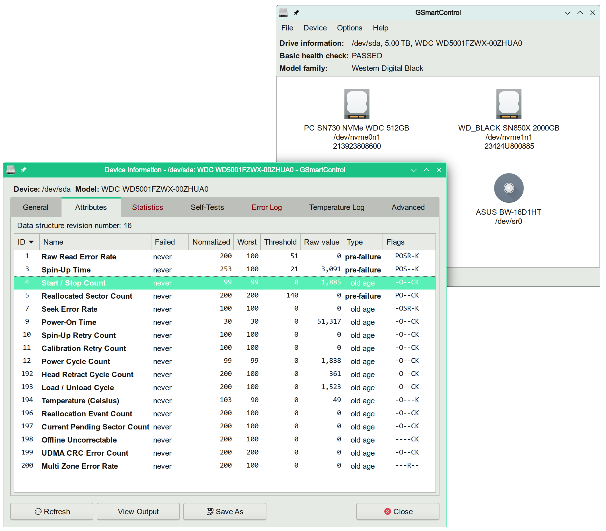
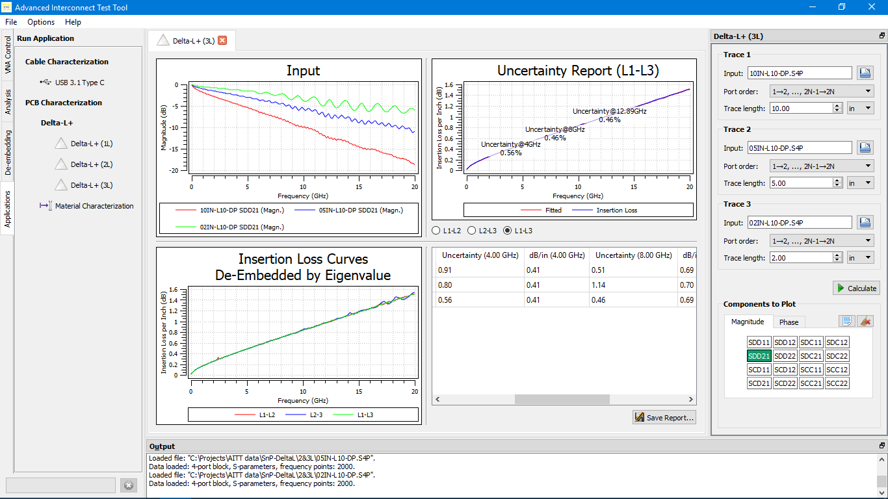
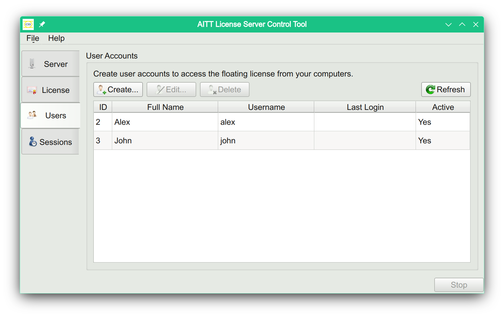
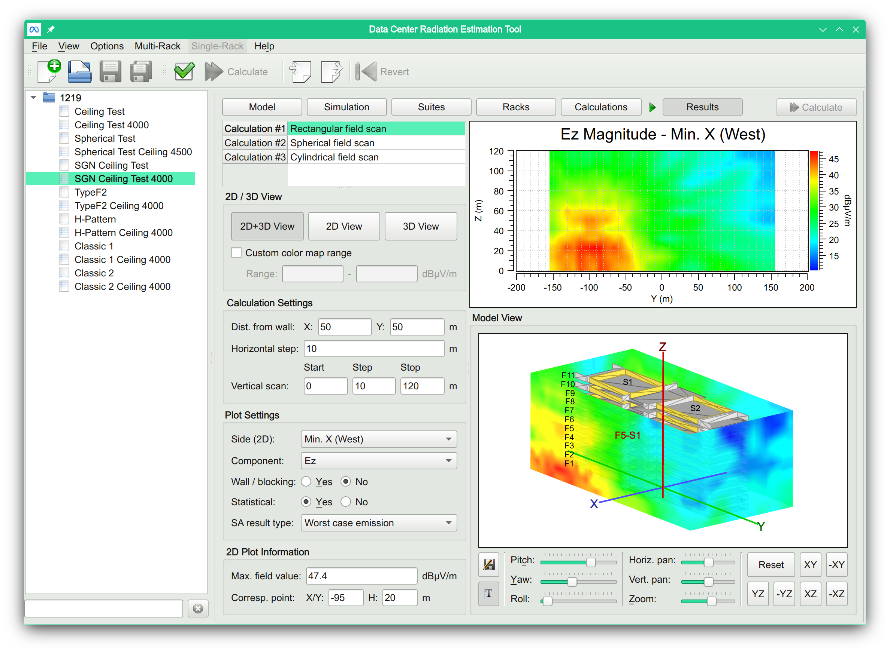
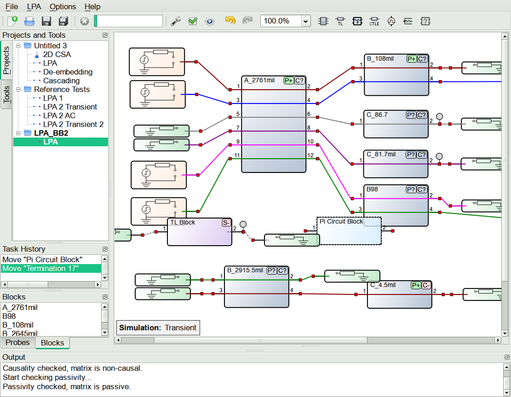

# Introduction

I am an experienced Software Engineer and open-source developer proficient in C++ and Rust,
dedicated to creating safe, reliable, and efficient software.

Most of my software is cross-platform, although I primarily use Linux as my desktop and
development platform.

---

# Contact

You can reach me by email at [ashaduri@gmail.com](mailto:ashaduri@gmail.com).

---

# Links

## [ github.com/ashaduri](https://github.com/ashaduri)
## [ linkedin.com/in/ashaduri](https://www.linkedin.com/in/ashaduri/)
## [ x.com/alex_shaduri](https://x.com/alex_shaduri)
## [ Alexander's programming tips](https://blog.shaduri.dev)
## [ shaduri.dev](https://shaduri.dev)

---

# Free Software Projects

Below is a selection of free software projects that I have developed.

---

## [GSmartControl](https://gsmartcontrol.shaduri.dev)

[//]: # (2008 – Present)

**Hard disk drive and SSD health inspection tool**

_GSmartControl is a graphical user interface for smartctl (from smartmontools package), which
is a tool for querying and controlling SMART (Self-Monitoring, Analysis, and Reporting Technology) data
on modern hard disk and solid-state drives. It allows you to inspect the drive's SMART data to determine
its health, as well as run various tests on it._

**Skills used:** C++98 - C++20, GTK+, Gtkmm, GUI development, cross-platform development, code modernization, systems programming, JSON, CMake,
autotools, Catch2, GitHub CI, GitHub pages, Doxygen, open-source collaboration.

As the **founder and principal maintainer of GSmartControl**, my contributions encompass:

- **GUI Development:** Developed a cross-platform graphical user interface using GTK+ and Gtkmm.
- **Codebase Modernization:** Systematically upgraded the core code from C++98 to newer standards such as C++11, C++17, and
C++20, ensuring the software stays current with modern programming practices.
- **System-Level Engineering:** Created cross-platform and system-level functionalities, including an OS abstraction library
and drive detection mechanisms with RAID support, ensuring compatibility with a wide range of operating systems
like Linux, Windows, macOS/Darwin, various BSD systems, QNX, and Solaris.
- **Data Parsing and Loading:** Implemented parsers for handling free-form text and loaders for JSON data formats.
- **Build and Packaging Systems:** Established a robust build process and packaging system using CMake and autotools,
ensuring cross-platform compatibility.
- **Continuous Integration:** Developed CI pipelines on GitHub and the Open Build Service, enabling automated testing, building,
and packaging of the application across multiple platforms.
- **Website Maintenance:** Managed project websites on GitHub Pages and SourceForge, providing users and developers with
up-to-date information and resources.

**Key Achievements:**

- **User Adoption:** The latest Windows version of GSmartControl has been **downloaded over 425,000 times**, demonstrating its
value and reliability to users.
- **Broad Integration:** GSmartControl is **included in major Linux distributions** such as Fedora, openSUSE,
Ubuntu, Mint, Debian, as well as FreeBSD and numerous rescue images, which significantly expands its user base.
- **Media Recognition:** GSmartControl was featured in several issues of **c't Magazin**, the most subscribed computer magazine in Europe,
highlighting the project’s impact and relevance in the tech community.

For a detailed look at the project's development, visit [GSmartControl Website](https://gsmartcontrol.shaduri.dev) and
[GSmartControl on GitHub](https://github.com/ashaduri/gsmartcontrol).

---

## [Csv::Parser](https://github.com/ashaduri/csv-parser)

[//]: # (2021 – Present)

**Compile-time and runtime CSV parser library in C++17**

_Csv::Parser is an RFC 4180-compliant CSV parser library written in C++17.
It leverages modern C++ features to provide a simple, extendable API, supporting zero-runtime-overhead
resource loading through compile-time parsing._

**Skills used:** C++17, Test-Driven Development (TDD), Catch2 framework, Doxygen, GitHub CI, open-source development.

As the **primary developer** of Csv::Parser, my contributions include:

- **Modern C++ API Design:** Leveraged modern C++17 features like `constexpr` and `string_view` to enable efficient compile-time parsing.
- **TDD:** Applied Test-Driven Development (TDD) techniques using the Catch2 framework for rigorous testing.
- **Continuous Integration:** Set up GitHub CI pipelines for consistent testing and building across multiple platforms.
- **Documentation:** Integrated Doxygen with GitHub to automate the generation and publishing of API documentation,
making the library easier to use and understand.

For a closer look at Csv::Parser, visit its GitHub repository: [github.com/ashaduri/csv-parser](https://github.com/ashaduri/csv-parser).

---

## [Qt-ccTalk](https://github.com/ashaduri/qt-cctalk)

[//]: # (2015)

**Cross-platform ccTalk protocol implementation in modern C++ / Qt**

_The Qt-ccTalk Library is a cross-platform implementation of the ccTalk protocol, developed using modern C++ and Qt.
The ccTalk protocol facilitates binary serial communication with bill validators and coin acceptors,
playing a crucial role in the money transaction and point-of-sale industries._

**Skills used:** C++14, Qt Framework, systems programming, thread-safe programming, specification implementation.

I developed Qt-ccTalk for use in a standalone self-service payment station software. My contributions include:

- **API Design and Implementation:** Engineering a high-level, type-safe, and asynchronous API for ccTalk,
adhering closely to the ccTalk Serial Communication Protocol Specification. This approach enhances ease of use and system reliability.
- **Thread Management and Message Passing:** Integrating Qt's capabilities for thread management and message
passing to enable thread-safe, non-blocking communications with multiple ccTalk devices, optimizing performance and scalability.
- **GUI Development:** Creating a GUI application using Qt to monitor protocol channels and manage testing
and operation of ccTalk devices, significantly improving device management and debugging.

For more information, visit the GitHub repository: [github.com/ashaduri/qt-cctalk](https://github.com/ashaduri/qt-cctalk).

---

## Other Open-Source Work

Throughout my career, I've been deeply involved in the open-source community. I have contributed
to numerous projects by reporting issues, fixing bugs, and submitting improvements.
I also take pride in keeping older software relevant and up-to-date.

Key Contributions:

- **Library Maintenance:** I've taken on the maintenance of libraries like QtIOCompressor and QtMmlWidget,
updating them to work with new versions of Qt and C++. This work ensures these tools continue to serve 
their user communities effectively.

- **Problem-Solving:** I routinely spot and fix issues in various projects, contributing patches that help keep
these projects functional and useful for everyone.

I love being part of the open-source community and appreciate how it allows me to contribute to meaningful 
projects while continuously learning and growing as a developer.

---

# Commercial Projects

Below is a partial list of the commercial projects I have worked on.

---

## Clear Signal Solutions, Inc.

[//]: # (Remote – Santa Clara, CA, USA)
[//]: # (Jan 2020 – Present)

_Clear Signal Solutions, Inc. ([clearsig.com](https://clearsig.com)), also known as CSS, is a
California-based company providing measurement and
characterization solutions for signal and power integrity applications._

---

### AITT  - Advanced Interconnect Test Tool

**A Versatile Tool for Interconnect Analysis and PCB Characterization**

[//]: # (Jan 2020 - Present)

_AITT is a flagship product of CSS used for signal integrity analysis and PCB characterization.
It is used by many Fortune 100 companies including **Intel, Amazon, Meta, Microsoft, and Cisco**._

**Skills used:** C++17, Qt, Qwt, CMake, Catch2, ECMAScript, public API design, software integration,
GitHub CI, technical documentation development, Doxygen, jsdoc.

As the **lead developer for AITT**, I have played a key role in every stage of its development - from
the initial design through to implementation and integration. Here's a closer look at my contributions:

- **System Architecture and Protocols:** Developed the program architecture, a type-safe binary communications protocol,
and a robust copy protection mechanism using file, USB, and network licensing.
- **GUI Development:** Created most of the graphical user interface using C++17, Qt, and Qwt
to ensure a smooth and responsive user experience.
- **Scripting API:** Designed and implemented a scripting API based on ECMAScript,
which allows third-party developers to easily integrate AITT with their systems.
- **Customer and Integrator Collaboration:** Actively collaborated with integrators and
customers to understand their needs and supported the integration of AITT into their
hardware and software solutions.
- **Build System and CI Pipelines:** I established a CMake-based build system and
set up continuous integration pipelines on GitHub. This automation enhances the
building, testing, and packaging process.
- **Technical Documentation:** I wrote comprehensive technical documentation,
including an _Integration Guide_, _Scripting API Reference_, and _Licensing Scheme
Specification_.

**Key Achievements:**
- **Industry Adoption:** The user-friendly interface of AITT, which I largely
designed and developed, has been **instrumental in its adoption by industry giants**.
- **Integration Success:** My strategic approach to software design has enabled
partner hardware manufacturers to seamlessly integrate AITT into their products.
This integration has **doubled sales** and strengthened our market position.

---

### AITT-FLS - AITT Floating License Server
[//]: # (Apr 2020 - Present)

_AITT-FLS is a cross-platform (Windows, Linux) server software for providing floating licenses to AITT._

**Skills used:** Rust programming language, REST API design, JSON, JSend, C++, Qt,
SQLite, GitHub and GitLab CI, cross-platform development, webservice development.

As the **primary developer** for AITT-FLS, I was responsible for a range of technical and design aspects. Here's what I focused on:

- **Rust Development:** Built the network server software (FLS) using Rust, focusing on reliability and performance.
- **Server Administration Panel:** Developed the server's Administration Panel using C++17 and Qt,
making it easy for users to manage and monitor the system.
- **Protocol Design:** Created and implemented a JSON/JSend-based RESTful protocol to enable smooth communication
between AITT and FLS, and between the Administration Panel and FLS.
- **Database Integration:** Used Rust Diesel and SQLite for a persistent storage solution in FLS.
- **Security Features:** Implemented a secure authentication system using JSON Web Tokens (JWT)
to protect access and ensure data safety.
- **Continuous Integration:** Managed CI pipelines on GitLab and GitHub, automating the build
and testing processes to maintain high standards of code quality and system stability.

**Achievements**:
- **Boosting Product Sales:** AITT-FLS was developed in response to customer needs,
and has now become a significant feature of AITT. This capability enables companies
to purchase license seats, resulting in **increased sales and enhanced customer satisfaction**.

---

### CSS License Manager

[//]: # (Oct 2017 - Present)

**Web-based application for managing licenses.**

**Skills used:** PHP, Yii framework, MySQL, public REST API design, web application development,
responsive application design, Bootstrap, JQuery, HTML5, RBAC, Linux.

I am the **primary developer** of CSS License Manager, a web-based application designed to issue, track, and manage AITT
licenses efficiently.
Here is an overview of my contributions:

- **Web Application Development:** Developed a responsive web application utilizing PHP, the Yii framework, MySQL for
transactional database management, the Bootstrap CSS framework, JQuery, and HTML5. This combination ensured a robust
and user-friendly interface.
- **API Design and Implementation:** Designed and implemented a RESTful API that allows third-party AITT integrators to
seamlessly incorporate our licensing process into their automated factory operations.
- **Partner Collaboration:** Worked directly with partners, assisting them in integrating our REST web services and
meeting their business and technical requirements.
- **Permission System:** Designed and implemented a Role-Based Access Control (RBAC) system. This system provides tailored
access levels for the company, its distributors, and resellers, enhancing security and operational efficiency.
- **Continuous Integration Pipelines:** Developed CI pipelines on GitLab and GitHub for automated testing across various
PHP and MySQL/MariaDB versions, ensuring consistent software quality.
**Deployment:** Successfully deployed the application on a Linux server.

**Impact of CSS License Manager:**
- **Vital Role in Operations:** CSS License Manager is crucial in operations, particularly for enabling integrators
to incorporate licensing into their automated processes. **More than half of sales** stem from integrations.
- **Significant Contribution:** The development of this product has significantly **contributed to the company's success**.

---

## EMC Lab, Missouri University of Science and Technology

[//]: # (Remote – Rolla, Missouri, USA)
[//]: # (Aug 2010 – Present)

_Researchers at the **S&T EMC Lab** ([emclab.mst.edu](https://emclab.mst.edu)) focus on electromagnetic compatibility, 
power integrity, and signal integrity for industry needs. They aim to expand knowledge, train skilled personnel,
and create innovative tools to
address current and future EMC challenges, ensuring the lab leads in solving electromagnetic compatibility issues across
various sectors._

---

### DCRET by Meta Platforms, Inc.

[//]: # (Sep 2018 - Dec 2023)

**Data Center Radiation Estimation Tool**

_The Data Center Radiation Estimation Tool (DCRET) is an innovative application developed in collaboration with **Meta
Platforms, Inc.**, formerly known as **Facebook**. DCRET predicts electromagnetic emissions from entire buildings based on
measurements from a single rack, aiding engineers in designing more efficient data center buildings and layouts._

**Skills used:** C++17, Qt, OpenGL, GUI programming, OpenMP, Intel DPC++, Intel VTune, software optimization, CMake.

**My key contributions to DCRET include:**

- **Graphical User Interface:** Developed the GUI using C++ and Qt, providing a user-friendly platform for interaction with
the tool.
- **3D Simulation Results:** Utilized OpenGL to present interactive 3D simulation results, enhancing the visualization
capabilities of the tool.
- **Optimization of the engine:**
  - Enhanced OpenMP support to improve parallel processing capabilities.
  - Created a special build system and a multi-architecture engine selector that chooses a microarchitecture-specific binary based on
the user's CPU.
  - Conducted in-depth analysis and optimization of the C++ code using the Intel DPC++ Compiler and Intel VTune
Profiler, resulting in a 2.4x average speed increase in the engine.
- **Automated Result Validation:** Implemented features for automated validation of simulation results to ensure accuracy.
- **Software License Protection:** Implemented mechanisms to protect the software license, securing intellectual property.

**Achievements and Impact:**
- **Significant Role in Contract Renewal:** My contributions to DCRET were pivotal in Meta Platforms' decision
to **renew their contract** with EMC Lab multiple times.
- **Optimization Success:** Engine optimizations drastically **reduced the simulation completion time** from days to mere hours.

[//]: # (Program description:)
[//]: # (Server systems are often tested in a chamber or Open Area Testing Site &#40;OTAS&#41; for EMI compliance with a typical)
[//]: # (configuration, where a minimum number of racks are used due to the limited space in the chamber or OATS. However,)
[//]: # (real-world systems in medium to large scales may involve many racks of server equipment. It is highly desirable to&#41;)
[//]: # (predict the electromagnetic emissions from the entire system based on the measurement of a single rack. In this project,&#41;)
[//]: # (the emission of a single rack server is measured at first. Then an algorithm is developed to extract the equivalent&#41;)
[//]: # (sources of rack servers based on magnitude-only EMI information. Next, a divide and conquer algorithm is proposed to&#41;)
[//]: # (estimate EM emissions from the whole data center. This tool supports various data center configurations in the real&#41;)
[//]: # (world. The actual building structure of the data center is taken into consideration and angle-dependent transmission&#41;)
[//]: # (coefficient is obtained for more accurate estimation of wave absorption and reflection of the building structure using&#41;)
[//]: # (the ray-tracing method.)

---

### FEMAS (Fast Electromagnetic Analysis Suite)

**Tools for engineers to assist in PCB and system design**

[//]: # (Sep 2018 - Dec 2023)
[//]: # (http://www.ems-plus.com/FEMAS_main.html)

_FEMAS solves different types of signal and power integrity problems in electrical engineering.
FEMAS contains many tools, including 2D Cross-Sectional Analysis, Multi-layer Via Transition,
Link Path Analysis, etc. The software is available for Windows and Linux and is used by
many industry giants including **IBM, Dell, Cisco**, and others._

**Skills used:** C++, Qt, Qwt, GUI programming, ECMAScript API design, C API design,
application scripting, OpenMP, CMake, cross-platform development.

As the **lead architect and GUI developer** for FEMAS, I made the following contributions:

- **GUI Development:** Most of the FEMAS graphical user interface was implemented using C++, Qt, 
and Qwt, focusing on usability, performance, and cross-platform functionality.
- **Feature Implementation:** Developed essential features such as project management,
an undo/redo system, update checks, and other functionalities that enhance user interaction and software reliability.
- **Communications Protocol:** Designed and implemented a type-safe binary protocol facilitating communication between
the GUI and solver processes, ensuring efficient data handling.
- **External API:** Created an ECMAScript-based external API for batch processing,
allowing for automated and scalable operations.
- **Data Storage:** Designed and implemented compressed binary storage formats
to optimize the storage of project data, reducing space and improving load times.
- **Algorithm Optimization:** Optimized existing algorithms to support multi-core processing using OpenMP,
significantly enhancing performance.
- **File Parsing:** Implemented fast and safe parsers for industry-standard file formats like Touchstone,
improving the speed and accuracy of data import.
- **C API Development:** Designed and implemented an ABI-stable C API around the C++ codebase,
enabling customers to integrate FEMAS functionality into their projects via DLLs.
- **Cross-Platform Compatibility:** Ensured that all contributed code was compatible across Windows
and Linux platforms and prepared for future technological advancements.

[//]: # (Program description:)
[//]: # (Software tools to solve different types of Signal Integrity and Power Integrity problems in Electrical Engineering. The Software contains the following tools:)
[//]: # (2D Cross Sectional Analysis;)
[//]: # (Causality and Passivity Checking/Enforcing;)
[//]: # (Multi-layer Via Transition Tool;)
[//]: # (Link Path Analysis;)
[//]: # (TDR/TDT;)
[//]: # (Network Parameters Conversion;)
[//]: # (Power Distribution Network;)
[//]: # (De-Embedding;)
[//]: # (Fixture Characterization;)

---

### Femas-Framework

[//]: # (Aug 2010 - Present)

_The Femas-Framework is a versatile cross-platform C++ application framework designed for developing
applications related to signal integrity, power integrity, and electromagnetic simulations._

**Skills used:** C++, Qt, Qwt, GUI programming, Catch2, systems programming,
cross-platform development, software architecture design, Doxygen, jsdoc.

As the **lead designer** of framework, my contributions include:
- **Core Development:** Utilized C++ and Qt to establish the core foundation of the framework, ensuring robust
and scalable architecture.
- **Plugin Architecture:** Implemented a flexible plugin architecture that allows for customized compilations
with varying functionalities tailored to specific needs.
- **OS Abstraction and Utilities:** Developed an OS abstraction library along with a comprehensive
C++ utility library to streamline cross-platform development and enhance developer efficiency.
- **Plot Widget Library:** Built a fully featured 2D plot widget library leveraging the Qwt library,
facilitating advanced data visualization capabilities.
- **Plugin Development:** Created a diverse range of plugins to enhance the framework’s functionality, including:
  - Integration of OS functionalities within the scripting API.
  - Tools for plotting Touchstone files and generic data.
  - Conversion tools for Network Parameter formats.
  - GUI tools for analyzing Passivity, Causality, and Reciprocity.
  - Numerous other functional plugins.

**Key Achievements:**
 - My strategic foresight in the software architecture design enabled EMC Lab’s products
to be built modularly, **significantly reducing development time** for new projects.
- My commitment to developing portable C++ code from the outset
allowed for the effortless creation of Linux versions of applications upon customer request,
greatly **enhancing customer satisfaction**.

---

## Other Projects

Some of the older projects I worked on are listed on the [Old Projects](old_projects.md) page.

